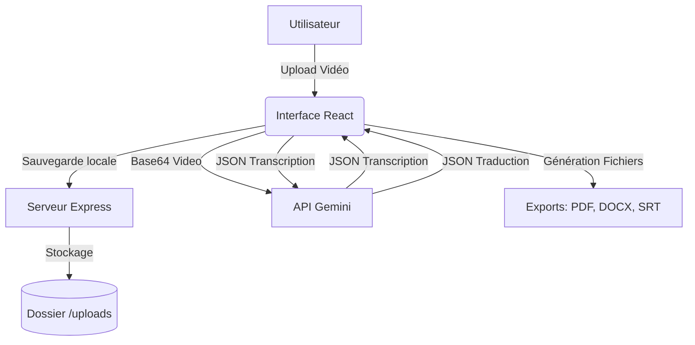

*Dernière mise à jour : 2026-04-14*

# Vue d'ensemble
**Transcribe & Translate AI** est une application locale monolithique. Elle utilise un serveur Express pour gérer le système de fichiers local et sert une interface React (Vite) pour l'interaction utilisateur. Le traitement lourd (IA) est déporté vers l'API Gemini.



# Arborescence du projet
```text
/
├── docs/                  # Documentation du projet
├── uploads/               # Stockage local des vidéos brutes
├── transcriptions/        # (Prévu) Stockage des JSON de transcription
├── subtitles/             # (Prévu) Stockage des sous-titres générés
├── documents/             # (Prévu) Stockage des PDF/Word générés
├── src/                   # Code source Frontend
│   ├── components/        # Composants UI réutilisables
│   ├── services/          # Logique métier et appels API
│   │   ├── export.ts      # Génération PDF, DOCX, SRT, VTT
│   │   └── gemini.ts      # Communication avec l'API Google Gemini
│   ├── App.tsx            # Composant principal (Logique UI)
│   ├── index.css          # Styles globaux (Tailwind)
│   └── main.tsx           # Point d'entrée React
├── server.ts              # Point d'entrée Backend (Express)
├── vite.config.ts         # Configuration du bundler
└── package.json           # Dépendances et scripts
```

# Fichiers significatifs

### `server.ts`
- **Rôle :** Serveur web local. Gère les uploads via Multer et sert l'application React.
- **Importance :** Critique.
- ✔ **Pourquoi il existe :** Pour permettre l'accès au système de fichiers local (impossible depuis un navigateur pur).
- ✔ **Ce qui casse s'il disparaît :** L'application ne démarre plus, les uploads échouent.
- ✔ **Qui l'utilise :** Le script `npm run dev`, le frontend pour l'upload.

### `src/App.tsx`
- **Rôle :** Cœur de l'interface utilisateur. Gère l'état (fichier, progression, résultats).
- **Importance :** Critique.
- ✔ **Pourquoi il existe :** Fournit l'interface d'interaction principale.
- ✔ **Ce qui casse s'il disparaît :** Plus d'interface utilisateur.
- ✔ **Qui l'utilise :** `main.tsx`.

### `src/services/gemini.ts`
- **Rôle :** Interface avec l'IA. Contient les prompts et la validation de schéma JSON.
- **Importance :** Haute.
- ✔ **Pourquoi il existe :** Isole la logique complexe de l'IA du composant UI.
- ✔ **Ce qui casse s'il disparaît :** La transcription et la traduction ne fonctionnent plus.
- ✔ **Qui l'utilise :** `App.tsx`.

### `src/services/export.ts`
- **Rôle :** Formatage des données en fichiers téléchargeables.
- **Importance :** Moyenne (Fonctionnalité clé mais isolée).
- ✔ **Pourquoi il existe :** Centralise la logique de génération de fichiers (séparation des responsabilités).
- ✔ **Ce qui casse s'il disparaît :** Impossible de télécharger les résultats.
- ✔ **Qui l'utilise :** `App.tsx`.

# Conventions
- **Nommage :** `camelCase` pour les variables/fonctions, `PascalCase` pour les composants React.
- **Architecture :** Logique métier extraite dans `/services`.
- **CSS :** Utilisation exclusive des classes utilitaires Tailwind CSS, avec quelques classes personnalisées (`.btn-primary`, `.glass`) dans `index.css`.

# Points critiques / Dettes techniques
- **Taille des vidéos :** La conversion en Base64 côté client (`fileToBase64`) peut faire crasher le navigateur pour les très gros fichiers (> 100MB). *Amélioration prévue : uploader d'abord le fichier, puis laisser le backend Node.js l'envoyer à Gemini via l'API File.*
- **Gestion des erreurs :** La gestion des erreurs réseau ou de timeout de l'API Gemini est basique.
